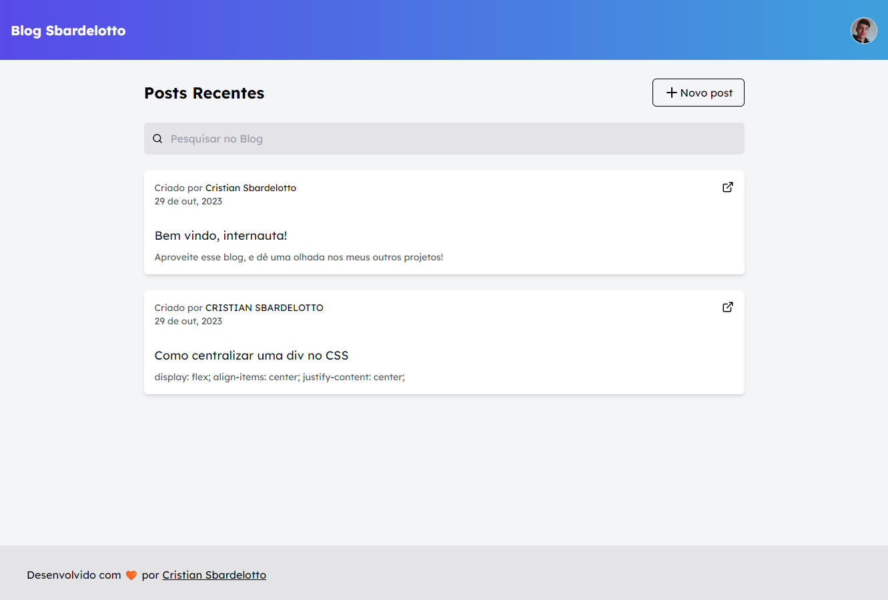

<h1 align="center"> 🧡 Blog Sbardelotto 🧡 </h1>

<p align="center">
This website is a simple Blog, that includes basically features such as <strong>create</strong>, <strong>read</strong>, and <strong>manage</strong> some posts.
</p>

<p align="center">
  <a href="#technologies">Technologies</a>&nbsp;&nbsp;&nbsp;|&nbsp;&nbsp;&nbsp;
  <a href="#learning">What I've Learned</a>&nbsp;&nbsp;&nbsp;|&nbsp;&nbsp;&nbsp;
  <a href="#installation">Installation</a>&nbsp;&nbsp;&nbsp;|&nbsp;&nbsp;&nbsp;
  <a href="#layout">Layout</a>&nbsp;&nbsp;&nbsp;&nbsp;&nbsp;&nbsp;
</p>

<br>

<p align="center">
  
</p>

<br />
<h1 id='technologies'>🖱️ Technologies</h2>

<p>This project was made with the following technologies/libraries:</p>

- TypeScript
- NextJS
- TailwindCSS
- Prisma
- React Hook Form
- Zod
- NextAuth
- Lucide-react (icons)
- Git & Github
- Eslint + Prettier (code maintenance)

<br />

<h1 id='learning'>🧠 What I've Learned</h2>

<p>In this website, I worked with:</p>

- Usage of [React Hook Form Library](https://react-hook-form.com/)
- Usage of [Zod](https://zod.dev/)
- [Composition Pattern](./src/components/PostCard/)

<br />

<h1 id='layout'>🖥️ Layout</h1>

<br />

To develop this project, I used this [Figma Design](https://www.figma.com/file/Yb9IBH56g7T1hdIyZ3BMNO/Desafios---Codel%C3%A2ndia?type=design&node-id=0-1&mode=design&t=1MUyfbxsD7SsxHoP-0).

To see the Deploy, check [this link](https://blog-sbardelotto.vercel.app/).

<br />

<h1 id='installation'>📤 Installation</h1>

<h3>Firstly, you need to <strong>clone the project</strong> on your machine:</h3>

```bash
git clone https://github.com/cristian-sbardelotto/blog-sbardelotto
```

<br />

<h3>After that, open the project folder and <strong>install the dependencies:</strong></h3>

```bash
npm install
# or
yarn
#or
pnpm install
```

<h3>To <strong>run the project</strong> on your browser, use:</h3>

```bash
npm run dev
# or
yarn dev
# or
pnpm dev
```

<br/>

<div align='center'>

<h2 align='center'>Enjoy this project!</h2>

<br />

Developed with 🧡 by <strong>Cristian Sbardelotto</strong>

<br />

[](https://www.linkedin.com/in/cristian-k-sbardelotto/)
[](https://github.com/cristian-sbardelotto)

[](https://portfolio-chi-lemon-51.vercel.app)

</div>
